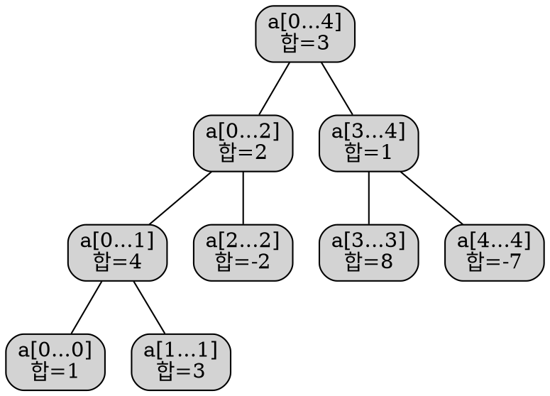
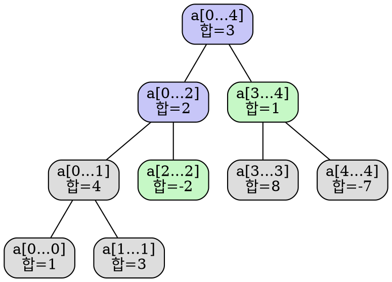
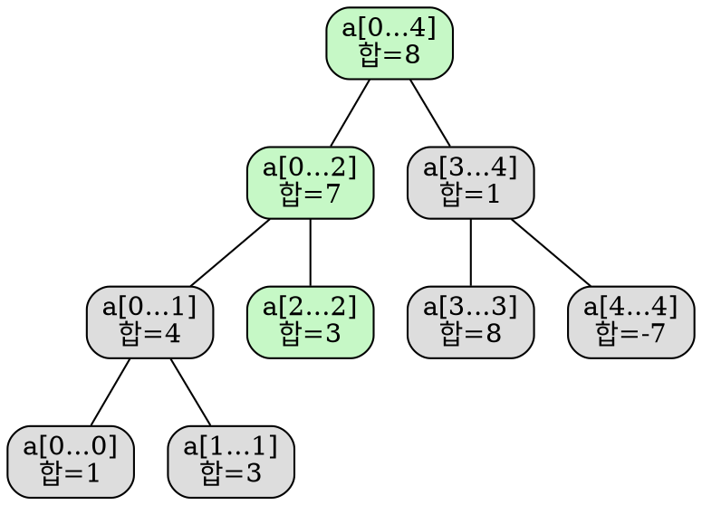

# TOC

# 세그먼트 트리

세그먼트 트리는 배열 구간에 대한 정보를 트리 구조로 저장하는 자료구조이다. 이를 통해 배열에 대한 구간 질의를 효율적으로 처리할 수 있으며, 동시에 배열의 값을 빠르게 수정하는 것도 가능하다.
예를 들어, $O(\log n)$ 시간에 연속된 배열 원소들의 합 $a[l \dots r]$을 구하거나, 해당 구간 내의 최솟값을 찾는 일이 여기에 포함된다.
이러한 질의를 처리하는 도중에도, 특정 원소 하나를 바꾸거나 구간 전체를 특정 값으로 덮거나 일정 값을 더하는 등 구간 전체에 대한 수정도 빠르게 처리할 수 있다.

세그먼트 트리는 매우 유연한 자료구조이며, 이를 활용하여 해결할 수 있는 문제도 매우 많다.
또한, 더 복잡한 연산이나 질의에도 응용이 가능하다 (자세한 내용은 [세그먼트 트리의 고급 버전](segment_tree.md#advanced-versions-of-segment-trees) 참고).
특히, 세그먼트 트리는 고차원으로 일반화하기도 쉬운데, 예를 들어 2차원 세그먼트 트리를 사용하면 행렬의 특정 부분 사각형에 대한 합이나 최솟값 질의를 $O(\log^2 n)$ 시간에 처리할 수 있다.

세그먼트 트리의 중요한 특징 중 하나는, 필요한 메모리가 선형이라는 점이다.
일반적인 세그먼트 트리는 길이 $n$의 배열에 대해 약 $4n$개의 노드만 있으면 된다.

## 세그먼트 트리의 가장 단순한 형태

먼저 가장 단순한 형태의 세그먼트 트리부터 살펴보자.
이 경우에는 합 질의를 빠르게 처리하는 것이 목적이다.
문제를 형식적으로 정의하면 다음과 같다.

<Theorem>
배열 $a[0 \dots n-1]$이 주어졌을 때, 구간 $[l, r]$에 대한 합 $\sum_{i=l}^r a[i]$을 빠르게 구하고, 배열의 특정 원소 값을 바꾸는 작업(예를 들면, $a[i] = x$ 형태의 대입)도 빠르게 처리해야 한다.
이 두 연산을 __모두__ $O(\log n)$ 시간에 처리할 수 있어야 한다.
</Theorem>

이는 단순한 방식들에 비해 개선된 방법이다.
예컨대 단순 배열로 구현하면 원소 수정은 $O(1)$이지만, 구간 합을 구할 때는 $O(n)$이 걸린다.
반면에 누적합을 미리 구해두면 합은 $O(1)$에 구할 수 있으나, 배열 값을 바꿀 때는 누적합 전체를 수정해야 하므로 $O(n)$ 시간이 걸린다.

### 세그먼트 트리의 구조

세그먼트 트리는 분할 정복 방식으로 배열을 다룬다.
먼저 전체 배열 $a[0 \dots n-1]$의 합을 계산하여 저장한다.
그다음 배열을 반으로 나눠서 $a[0 \dots n/2-1]$, $a[n/2 \dots n-1]$에 대한 합을 각각 계산하고 저장한다.
이 과정을 반복하여 길이가 1인 구간이 될 때까지 나눈다.

이러한 방식으로 만들어지는 구조는 이진 트리로 볼 수 있다.
트리의 루트는 $a[0 \dots n-1]$이고, 리프 노드를 제외한 각 노드는 자식 노드를 두 개씩 가진다.
이러한 구조 때문에 '세그먼트 트리'라는 이름이 붙었으며, 실제 구현에서는 명시적으로 트리를 만들지 않더라도 논리적으로는 트리 구조이다 (구현은 [이곳](segment_tree.md#implementation) 참고).

다음 그림은 $a = [1, 3, -2, 8, -7]$ 배열에 대해 세그먼트 트리를 구성한 예이다:



이 구조를 보면 세그먼트 트리는 선형적인 수의 노드만을 필요로 함을 알 수 있다.
첫 번째 레벨에는 하나의 노드(루트)가 있고, 두 번째 레벨에는 두 개, 세 번째에는 네 개… 이런 식으로 노드 수가 증가하다가, 리프 노드의 수가 $n$이 된다.
최악의 경우 전체 노드 수는 $1 + 2 + 4 + \dots + 2^{\lceil\log_2 n\rceil} \lt 2^{\lceil\log_2 n\rceil + 1} \lt 4n$이다.

배열 크기 $n$이 2의 거듭제곱이 아닐 경우, 모든 레벨이 완전히 채워지지 않을 수 있다.
그림에서도 이러한 현상을 확인할 수 있다.
지금은 이 사실을 일단 무시해도 되지만, 구현 시에는 중요하게 작용한다.

세그먼트 트리의 높이는 $O(\log n)$이다. 루트에서 리프까지 내려갈 때마다 구간의 길이가 거의 절반씩 줄어들기 때문이다.

### 트리 구성

세그먼트 트리를 구성할 때는 먼저 다음 두 가지를 결정해야 한다:

1. 각 노드에 저장할 *값*:
   예를 들어 합 세그먼트 트리에서는 구간 $[l, r]$의 합을 저장한다.

2. 두 자식 노드를 병합하는 *병합 연산*:
   예를 들어 합 세그먼트 트리에서는 구간 $a[l_1 \dots r_1]$, $a[l_2 \dots r_2]$을 다루는 두 노드가 있다면, 이 둘의 값을 더하여 구간 $a[l_1 \dots r_2]$의 값을 계산한다.

어떤 노드가 원래 배열의 값 하나만 포함하는 경우, 이를 리프 노드라고 한다.
이 리프 노드는 트리의 최하단에 위치하며, 노드 값은 배열 $a[i]$와 동일하다.

리프 노드부터 시작하여 각 노드에 값을 채워 넣음으로써 트리를 구성한다.
자식 노드의 값들을 병합 연산으로 합쳐가며 상위 노드의 값을 계산한다.
이 과정을 반복하면 루트 노드까지 올라가게 된다.

이 과정을 재귀적으로 설명하면 더 직관적이다.
리프가 아닌 노드에 대해 다음 절차를 따른다.

1. 두 자식 노드를 재귀적으로 구성한다.
2. 자식 노드 값을 병합 연산으로 합친다.

이렇게 루트부터 시작하여 전체 트리를 구성할 수 있다.

병합 연산이 $O(1)$ 시간에 가능하다고 하면, 전체 구성 시간은 $O(n)$이다.
병합 연산은 세그먼트 트리의 내부 노드 수만큼, 즉 $n$번 호출된다.

### 합 질의

이제 구간 합 질의를 처리해 보자.
입력으로는 정수 $l$, $r$이 주어지며, 구간 $a[l \dots r]$의 합을 $O(\log n)$에 계산해야 한다.

이를 위해 세그먼트 트리를 순회하며 미리 계산된 구간 합을 이용한다.
현재 노드가 구간 $a[tl \dots tr]$을 담당하고 있다고 하자. 가능한 경우는 다음의 세 가지이다.

1. **정확히 일치하는 경우**

    $a[l \dots r] = a[tl \dots tr]$이면 현재 노드의 값을 그대로 반환하면 된다.

2. **왼쪽 또는 오른쪽 자식의 구간에 완전히 포함되는 경우**

   왼쪽 자식은 $a[tl \dots tm]$, 오른쪽 자식은 $a[tm+1 \dots tr]$을 담당한다 ($tm = (tl + tr)/2$).
   질의 구간이 이 중 하나에 포함된다면 해당 자식 노드로 이동하여 같은 방법을 재귀적으로 적용하면 된다.

3. **양쪽 자식 모두와 겹치는 경우**

   이 경우 왼쪽 자식과 오른쪽 자식 각각에 대해 부분 질의를 수행하고, 결과를 합친다.
   즉, $a[l \dots tm]$의 합은 왼쪽 자식으로, $a[tm+1 \dots r]$의 합은 오른쪽 자식으로부터 얻고 둘을 더한다.

이러한 방식으로 합 질의는 재귀적으로 처리되며, 재귀는 현재 노드가 질의 구간과 정확히 일치할 때 종료된다.
이때는 해당 노드에 저장된 미리 계산된 값을 반환하면 된다.

즉, 합 질의는 트리를 필요한 만큼만 순회하여 구간을 나누고, 나뉜 구간들의 합을 미리 저장된 값을 이용해 계산하는 방식이다.

트리 순회는 루트 노드부터 시작한다.

다음 그림은 $a = [1, 3, -2, 8, -7]$일 때, $\sum_{i=2}^4 a[i]$를 계산하는 과정이다.
방문한 노드는 색으로 표시되어 있으며, 초록색 노드는 해당 값을 직접 사용한다.
결과는 $-2 + 1 = -1$이다.



이 알고리즘의 시간 복잡도가 $O(\log n)$인 이유는 무엇일까?
트리의 각 레벨마다 방문하는 노드는 최대 4개 이하이며, 트리의 높이가 $O(\log n)$이므로 전체 방문 노드 수는 $O(\log n)$개이다.

이는 수학적 귀납법으로 증명할 수 있다.
첫 번째 레벨에서는 루트 하나만 방문한다.
임의의 레벨에서 4개 이하의 노드를 방문한다고 가정하면, 다음 레벨에서도 각 노드가 자식 최대 2개만 방문하므로 총 8개를 넘지 않는다.
그러나 연속된 구간 합이라는 특성 때문에 가운데에 있는 완전히 포함된 구간은 더 내려가지 않는다.
따라서 실제로는 좌측 경계와 우측 경계에 해당하는 두 노드만 재귀호출을 한다.
결과적으로 한 레벨에서 최대 4개만 방문하게 된다.

따라서 전체적으로 $4 \log n$개의 노드만 방문하며, 시간 복잡도는 $O(\log n)$이다.

즉, 구간 합 질의는 질의 구간을 몇 개의 작은 구간으로 나누고, 이 구간에 대한 합이 트리에 미리 저장되어 있으므로 $O(\log n)$ 시간에 계산할 수 있다.

### 변경 질의

이제 배열의 특정 원소를 변경하는 경우를 살펴보자. $a[i] = x$와 같은 대입 연산을 수행하는 것을 생각해보자.
변경된 배열에 맞게 세그먼트 트리를 갱신해야 한다.

이 연산은 합 질의보다 더 간단하다.
세그먼트 트리의 각 레벨은 배열 전체를 분할하고 있으므로, 어떤 원소 $a[i]$는 각 레벨마다 하나의 구간에만 포함된다.
따라서 갱신이 필요한 노드는 $O(\log n)$개이다.

이 변경 연산은 재귀적으로 구현할 수 있다.
현재 노드가 포함하는 구간을 확인하고, $a[i]$가 포함되는 자식 노드로 재귀 호출한 뒤, 자식들의 값을 이용해 현재 노드의 값을 변경하면 된다 (이는 트리 구성 과정과 유사하다).

다음 그림은 동일한 배열에서 $a[2] = 3$으로 변경하는 과정을 나타낸다.
초록색 노드들이 변경된 노드이다.



### 구현

세그먼트 트리를 구현할 때 가장 먼저 고려해야 할 점은, 이 자료구조를 어떻게 저장할 것인가이다.
물론 `Vertex` 구조체를 정의하여 각 노드에 대해 구간 정보, 구간 합, 자식 노드 포인터 등을 저장할 수도 있다.
하지만 이렇게 하면 포인터 등 불필요한 정보를 많이 저장하게 되므로 비효율적이다.

이 문제를 해결하기 위해 _암시적 자료구조_<sub>implicit data structure</sub>라는 기법을 사용할 수 있다.
이는 트리의 구조를 명시적으로 저장하지 않고, 합 정보만을 배열에 저장하는 방식이다.
(이와 비슷한 방식이 이진 힙에도 사용된다.)

예를 들어, 루트 노드의 합은 인덱스 1에, 그 자식 노드들의 합은 인덱스 2와 3에, 그 자식들은 인덱스 4~7에 저장되는 식이다.
1부터 시작하는 인덱싱을 사용할 경우, 인덱스 $i$의 노드의 왼쪽 자식은 $2i$, 오른쪽 자식은 $2i+1$에 저장된다.
반대로 부모 노드는 $\lfloor i/2\rfloor$ 위치에 있다.

이러한 방법을 사용하면 트리 구조를 따로 저장할 필요 없이, 배열 하나만으로 세그먼트 트리를 구성할 수 있어 구현이 매우 간단해진다.

앞서 말했듯이, 최대 $4n$개의 노드만 있으면 되므로 크기가 $4n$인 배열 하나만 준비하면 충분하다.
실제로는 이보다 적은 노드를 사용할 수도 있으나, 구현의 편의성을 위해 항상 $4n$ 크기로 할당해두는 것이 일반적이다.
이 경우 사용되지 않는 배열 원소들이 일부 존재하더라도 구현상 큰 문제가 되지 않는다.

결국, 세그먼트 트리는 다음과 같이 단순한 배열 $t[]$ 하나로 표현할 수 있다:

```cpp
int n, t[4*MAXN];
```

#### 트리 구성 함수

주어진 배열 $a[]$로부터 세그먼트 트리를 구성하는 함수는 다음과 같다.
재귀적으로 정의되며, 매개변수로는 다음이 전달된다.

* $a[]$: 원본 배열
* $v$: 현재 노드의 인덱스
* $tl$, $tr$: 현재 노드가 담당하는 구간의 왼쪽/오른쪽 경계

메인 함수에서는 보통 루트 노드 기준으로 $v = 1$, $tl = 0$, $tr = n - 1$로 호출한다.

```cpp
void build(int a[], int v, int tl, int tr) {
  if (tl == tr) {
      t[v] = a[tl];
  } else {
    int tm = (tl + tr) / 2;
    build(a, v*2, tl, tm);
    build(a, v*2+1, tm+1, tr);
    t[v] = t[v*2] + t[v*2+1];
  }
}
```

#### 합 질의 함수

구간 합 질의를 수행하는 함수도 재귀적으로 정의된다.
입력으로는 현재 노드의 정보 $v$, $tl$, $tr$과 함께 질의 구간의 범위 $l$, $r$이 주어진다.

코드를 단순하게 만들기 위해, 이 함수는 항상 왼쪽과 오른쪽 자식에 대해 각각 재귀 호출을 수행한다.
이때 실제로는 한 쪽만 호출해도 되는 경우도 있지만, 다른 한 쪽은 $l > r$ 조건으로 무시되도록 처리한다.

```cpp
int sum(int v, int tl, int tr, int l, int r) {
  if (l > r) return 0;
  if (l == tl && r == tr) return t[v];
  int tm = (tl + tr) / 2;
  return sum(v*2, tl, tm, l, min(r, tm))
          + sum(v*2+1, tm+1, tr, max(l, tm+1), r);
}
```

#### 값 갱신 함수

마지막으로 특정 위치의 값을 바꾸는 갱신 함수이다.
이 함수는 현재 노드의 정보와 더불어 변경할 위치와 값을 입력으로 받는다.

```cpp
void update(int v, int tl, int tr, int pos, int new_val) {
  if (tl == tr) {
    t[v] = new_val;
  } else {
    int tm = (tl + tr) / 2;
    if (pos <= tm)
      update(v*2, tl, tm, pos, new_val);
    else
      update(v*2+1, tm+1, tr, pos, new_val);
    t[v] = t[v*2] + t[v*2+1];
  }
}
```

# 참고 문헌

1. jakobkogler, et al. [Segment Tree](https://cp-algorithms.com/data_structures/segment_tree.html). cp-algorithms.com.
